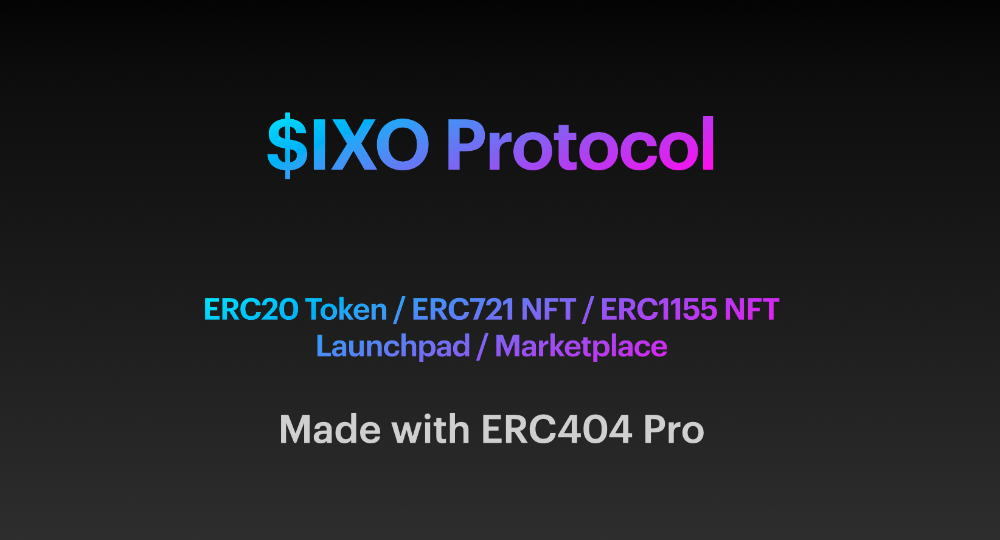
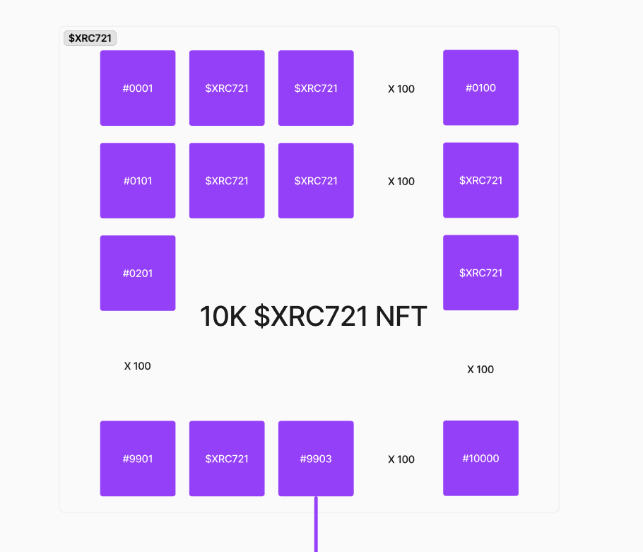
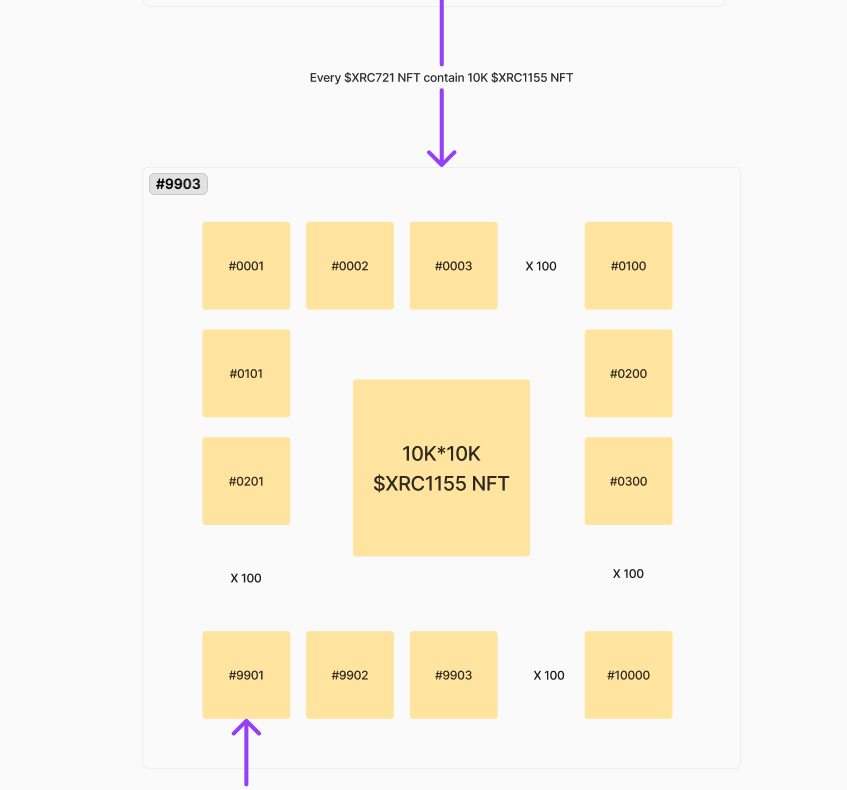
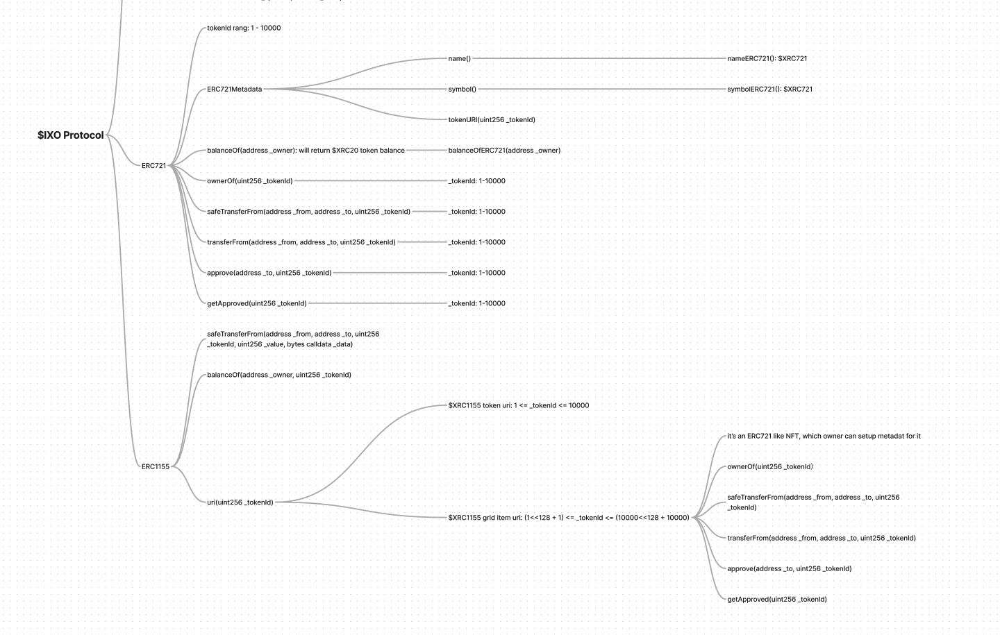
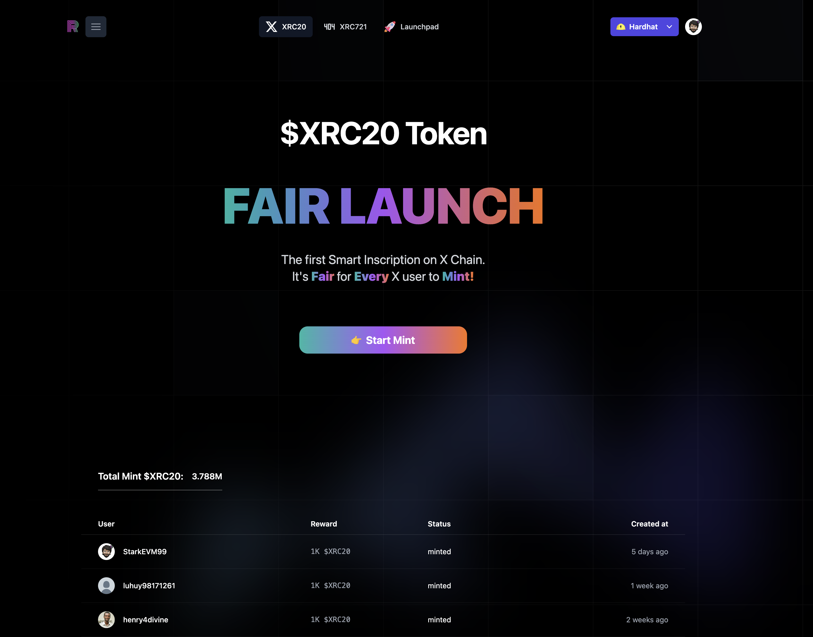
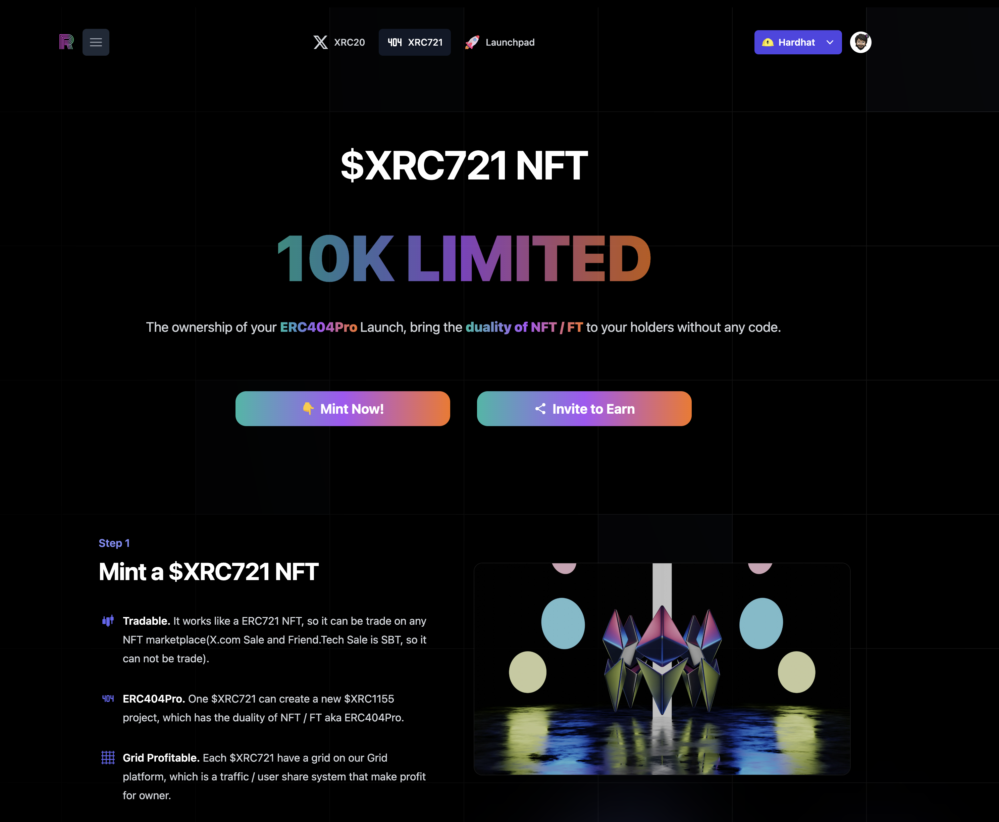
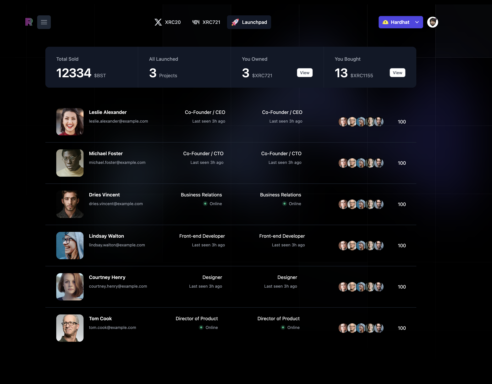

# ERC404Pro 

## links

* Smart Contract Deployment
  * [Bsc Testnet](https://testnet.bscscan.com/address/0xAB33Aa938EbDFe1CEA7876e0F0C1f8aDFFEa876C)
* [deck](./ixo-protocol.pdf)
* [Dapp online Demo](https://www.rwa-wallet.com/ixo/)
* [video demo in English](https://youtu.be/oU67kkgCCgE)
* [video demo in Chinese](https://youtu.be/5zubd3AFAfc)

## Challenges

### Challenge 5: Real world asset tokenization on BNB Chain

Our $IXOProtocol can provide a logic for real world assets to issue their token  without coding and provide a very greate liquality and also have NFT features for them.
It bring real world assets(RWA) to BNB Smart Chain ecosystem.
Such as we can bind the real estate into $IXOProtocol, and it can issue the house to bind with an NFT, if buy want to buy the whole house, just buy the NFT, but if the buyer do not have enough money to buy it(Also the seller want to sold the house more easily), it can be split into 10K $FT of the house, so buyer can buy only 1/10000 share of the house which is much cheaper for the house then.

### Challenge 6: Points trading system on BNB Chain

The $XRC20 and each project’s $XRC1155 FT also can be thread as a points system that record the activitly users for each projects and HelloRWA $IXOProtocoll platform.
It require users to auth with Twitter, then generate MPC wallet. Also make a share action to twitter tood.

## What is ERC404Pro?

ERC404Pro is an open, mixed ERC-20, ERC-721 and ERC1155 implementation designed to provide native fractionalization while supporting seamless integration with existing protocols.

But it is different from the [ERC404](https://github.com/Pandora-Labs-Org/erc404), it use a different logic about NFT / FT swap that bring the duality of NFT / FT to your NFT projects.

IXOProtocol is an implementation of the ERC404Pro.

## How it works in $IXOProtocol?

1. We have 10K $XRC721 NFT in total for our platform, project owner can buy the $XRC721 NFT, then they can use it to init their $XRC1155 project.

2. Every $XRC1155 project contain `10K NFT` or `10K * ftSwapUnit $FT`, it means 1 NFT can swap with`ftSwapUnit $FT`.

3. It mixed ERC-20, ERC-721 and ERC1155 implementation designed to provide a liquidity for every NFT project.

# The $IXO Protocol components

## $XRC20

The first Smart Inscription on X Chain. It's the functional token for $IXO Protocol. Required in various situations. No investment value!

## $XRC721

10K Total Supply, The owner of the $XRC721 got a lot of benefit for long run, eg: IXO Sell Income, platform Trading fee sharing.

## $XRC1155

$XRC721 can start IXO via sold $XRC1155 which has the duality of NFT and FT. User can swap 10K FT to get 1 NFT, or swap 1 NFT to get 10K FT.
Launchpad $XRC1155 new project launch here, It's the feed stream for IXO events, providing a platform for users to discover high-quality $XRC721 projects.

## Marketplace

The $IXO protocol builtin DEX, staking, and Pool modules provide an efficient, robust, and elegant decentralized market for $XRC2, $XRC721, and $XRC1155.

## Grid

All 10K $XRC721 NFT list on the grid that provides a visual map for our users, it can provide a farm function to generate profit from traffic.

## UI/UX

The project provides a beautiful and concise user UI/UX, and the $IXOProtocol supported behind it makes this beautifully introduced interface have a truly valuable function: the FT/NFT project token Launchpad

## Features

$IXOProtocol helps old NFT projects reactivate their liquidity (of course, new projects can also be launched directly on it).
Its unique FT/NFT duality will be extremely attractive to value projects, helping project parties better distribute their tokens/NFT while providing better liquidity to their users.
